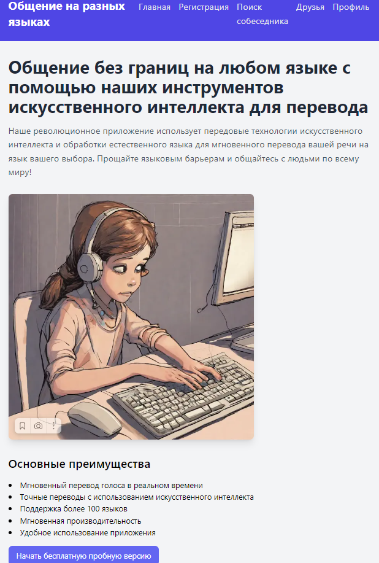
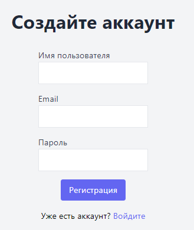
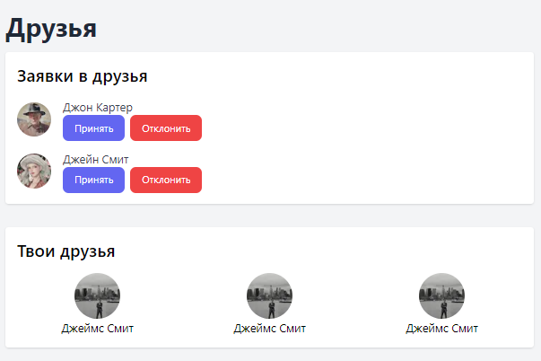

### Репозиторий дисциплины "ЧМИ - человеко-машинные интерфейсы"

<h2 align="center">
  :mailbox: Веб-приложение для общения с иностранцами на родном языке с использованием ИИ в NLP :email:
</h2>

---

### Цели:

В данном репозитории хранится макет сайта, оформленный с помощью Figma. А также сам сайт. сделанный с помощью Next.js. 

---

### Проектирование сайта

Перед началом верстки сайта, приступим к его проектированию. Для проектирвоания логики и бизнес-процессов сайта отлично подходят концепции проектирования: as_is и to_be:

  
  
 Рисунок 1 – Схема бизнес-процесса as_is 
 

  
  
 Рисунок 2 – Схема Бизнес-процессы to_be 
 

Прежде всего мы хотим, чтобы пользователя ничего не затрудняло в перемещени по страницам веб-сервиса, а также ему было удобно пользоваться нашим приложением с помощью интерфейса. 

---

### Внешний вид

Далее представим внешний вид нашего веб-приложения.

  
  
 Рисунок 3 – Главная страница 
 

Главная страница отобразится сразу же у любого пользвоателя, при входе на сайт, с помощью удобного и простого header пользвоатель сможет переключаться по вкладкам, а также просмотреть статус аккаунта (авторизован / не авторизован). 
Для авторизации пользователю нужно будет заполнить следующие поля:

  
  
 Рисунок 4 – Страница регистрации нового аккаунта 
 

При успешной авторизации пользователю будет доступен просмотр и редактирвоание личной информации об аккаунте, все это будет доступно по вклдке "Профиль"

  
  
 Рисунок 5 – Страница профиля пользователя 
 

Если полтзователь при использовании нашего сайта, или же сторонними способами наладил контакт с кем-то и подружился, то можно добавить друга в контакты во вкладке "Друзья".
На этой вкладке будет отображаться информация об друзьях, принявших заявку. отославших вам отосланные вами заявки в друзья.

  
  
 Рисунок 6 – Страница с добавленными в друзья аккаунтами 
 

Нам также важно, чтобы пользователю было удобно общаться с человеком на интересующию его тему. Поэтому у нас есть подбор по темам, возрастам, настроениям и странам.
Представим ситуацию, что у вас веселое настроение, у вас есть пара подготовленных "горячих" шуток и вы хотите поделиться ими с человеком в хорошем настроении вашей возрастной группы и, допустим, из Франции!?
Нет ничего проще, благодаря нам, вы сможете выставить нужные фильтры и наш сервис подберет вам подходящего собеседника!

  
  
 Рисунок 7 – Страница с подбором собеседника 
 

Ну, когда у вас уже завязался диалог с кем-то, то вы будете видеть это примерно так (ВАЖНО! чат будет отображаться на выбранном ВАМИ языке)

  
  
 Рисунок 8 – Страница с общением на сайте 
 

---
<h3 align="center">Как сказал однажды картавый электрик: <strong>Да будет talk!</strong></h3>

---
